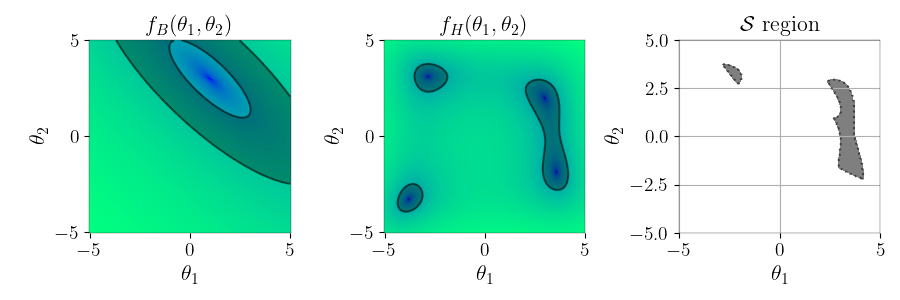
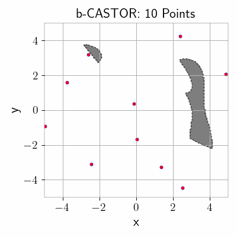

# hep-aid
**_hep._** High energy physics phenomenology.

**_aid._** Help, typically of a practical nature.

## Overview

In this work, we introduce a new Python library, `hep-aid`, which provides a modular framework for developing parameter scan algorithms for Beyond Standard Model (BSM) phenomenology. It manages High Energy Physics (HEP) software and provides components to ease the utilization, implementation, and development of parameter scan algorithms for phenomenological studies. The library comprises two main modules: the `hep` module and the `search` module.

## Modules

### `hep` Module
Facilitates the integration of the HEP software ecosystem into Python scripts.
- **Features**:
  - Allows users to perform a numerical point-wise evaluation of series of HEP software, wich we called HEP-Stacks, directly from python.
  - Currently, the SARAH family of programs is implemented: First generate the BSM model files with [SARAH](https://sarah.hepforge.org/). Then, [SPheno](https://spheno.hepforge.org/), [HiggsBounds](https://higgsbounds.hepforge.org/), [HiggsSignals](https://higgsbounds.hepforge.org/) and [MadGraph](https://launchpad.net/mg5amcnlo) can be run individually or sequentially as a HEP-Stack in `hep-aid`.

### `search` Module
Manages Parameter Scans algorithms using an Active Search Paradigm.
- **Features**:
  - Defines a Parameter Scan method as a combination between a *policy*, a *surrogate model* and an *objective-function*. Each of this components are implemented in `hep-aid` for every parameter scan method.

#### Parameter Scan Algorithms

This library was originally developed for experimentation in developing the b-CASTOR parameter scan method, where a surrogate model approximates the BSM model outputs and a search policy function needs to be defined. However, many parameter scan algorithms can be implemented following this paradigm, and the current objective of hep-aid is to ease the development, implementation, and utilization of general parameter scan algorithms. hep-aid currently includes:

- [b-CASTOR](https://arxiv.org/abs/2404.18653)
- [CAS](https://proceedings.mlr.press/v139/malkomes21a.html)
- MCMC Metropolis Hastings


### `search.objective` 

- The connection between the Parameter Scans algorithms in the `search` module and the HEP-Stacks in the `hep` module is established through the construction of an **objective function**. The `search` module includes an objective function constructor, which defines the search space, objectives, and constraints based on a predefined configuration.
  - The *objective function* constructor defines the search space, objectives, and constraints based on a predefined configuration. It maintains an internal dataset of samples.
  - Provides functionalities for saving, loading, and exporting datasets in formats such as Pandas DataFrame or PyTorch tensor.


## Installation

To install the `hep-aid` library clone this repository, an install by:
```bash
pip install .
```
## Toy example

Import one of the test functions implemented in `hep-aid`,
```python
from hepaid.search.objective.test import init_him_boo_fn

obj_fn =  init_him_boo_fn(cas=True)
```
This test function is a 2-dimensional, two-objective function. The search space $\mathcal{S}$, i.e., the satisfactory region where the constraints are met in both objectives, is defined by the constraints in the configuration. The function looks like the following plot:


Now, import the Parameter Scan method. In this example, we use b-CASTOR. Different methods have their own arguments; in this case, b-CASTOR receives the objective function and a configuration file for the algorithm's hyperparameters. If no configuration is provided, it will use the default hyperparameter settings.
```python
from hepaid.search.method import bCASTOR

bcastor = bCASTOR(objective_function=obj_fn)
surrogate, eci, study, metrics = bcastor.run()
```
In this case, the default hyperparameters include an initial dataset of 10 points and batch sampling of 10 points per iteration, along with other more specific hyperparameters for the algorithm. The following animation shows how the search is performed:



The `bcastor.run()` method returns the following:
- **Surrogate Model**: The model fitted in the last iteration.
- **ECI Policy Function**: The function used for the ECI (Expected Coverage Improvement) policy.
- **Optuna Study**: The study used to optimise the ECI function.
- **Metrics Instance**: An instance from the `Metrics` class, which records common metrics for parameter scan algorithms.
### Defining a New Objective Function


To define a new objective function, follow these steps:

1. **Define the Function**: Create a function that accepts an array with shape `(N,)`, where `N` is the number of dimensions in the search space. This function should return a dictionary containing all input and output variables.

2. **Create a Configuration Dictionary**: Define the configuration either as a Python `dict` or as a `.yml` file.

3. **Instantiate the `Objective` Class**: Pass the function and the configuration dictionary as parameters, as shown below:

```python
from hepaid.search.objective import Objective
from omegaconf import OmegaConf
import np

def him_boo(x):
    x, y = x[0], x[1]
    h =  np.log((x**2+y-11)**2 + (x+y**2-7)**2)
    b =  np.log((x+2*y-7)**2 + (2*x+y-5)**2)
    return  {'x': x, 'y': y, 'h': h, 'b': b }

function_config = OmegaConf.create({
  'input_space': {
    'x': {'lower': -5, 'upper': 5, 'distribution': 'uniform'}, 
    'y': {'lower': -5, 'upper': 5, 'distribution': 'uniform'}}, 
  'output_parameters': ['h', 'b'], 
  'objectives': {
    'double_constraint': {'b': [['gt', 2], ['lt', 4]]}, 
    'single_constraint': {'h': ['lt', 3.0]}
    }}) 

obj_fn = Objective(
  function_config=function_config,
  function=him_boo,
)
```


## Cite
A formal publication detailing this library is currently in preparation. In the interim, kindly cite the original work of b-CASTOR:
```latex
@misc{diaz2024bayesianactivesearchparameter,
      title={Bayesian Active Search on Parameter Space: a 95 GeV Spin-0 Resonance in the ($B-L$)SSM}, 
      author={Mauricio A. Diaz and Giorgio Cerro and Srinandan Dasmahapatra and Stefano Moretti},
      year={2024},
      eprint={2404.18653},
      archivePrefix={arXiv},
      primaryClass={hep-ph},
      url={https://arxiv.org/abs/2404.18653}, 
}
```
